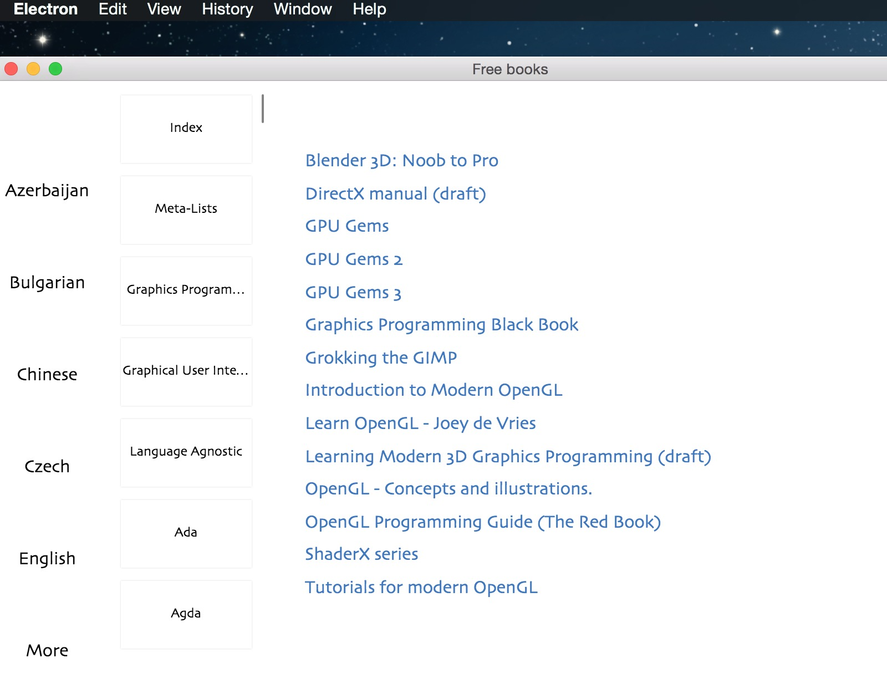

# electron-free-programming-books

**an application for free-programming-books.**


## About
Electron-free-programming-books is an application which Synchronize the List of Free Learning 
Resources from the project [free-programming-books](https://github.com/vhf/free-programming-books) and read them without web browser.
Built using [Electron](http://electron.atom.io/).


## Screenshot



## Developers

```
git clone https://github.com/scottkiss/electron-free-programming-books.git

cd electron-free-programming-books && npm install

npm start

```


## Build

```
npm run build:osx
npm run build:win
```


## License
view the [LICENSE](https://github.com/scottkiss/electron-free-programming-books/blob/master/LICENSE.md) file
